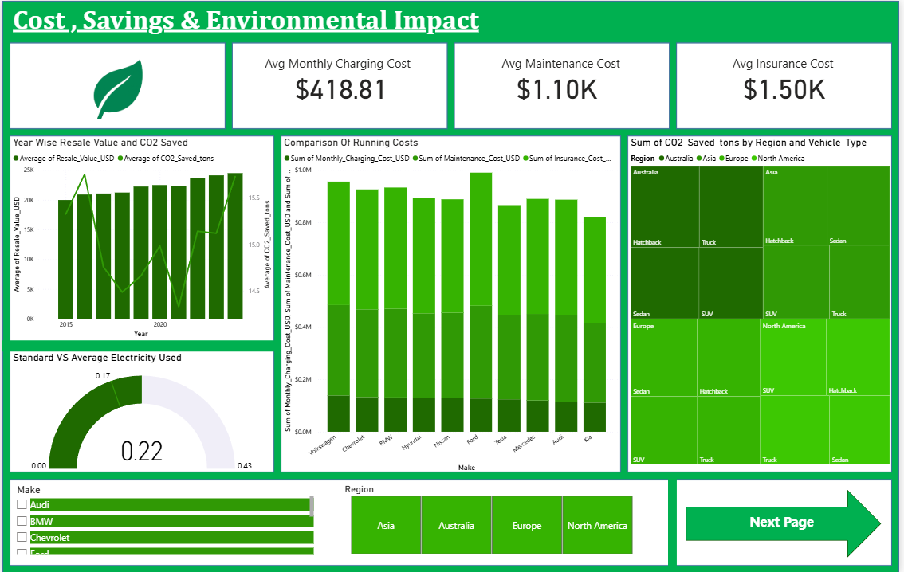
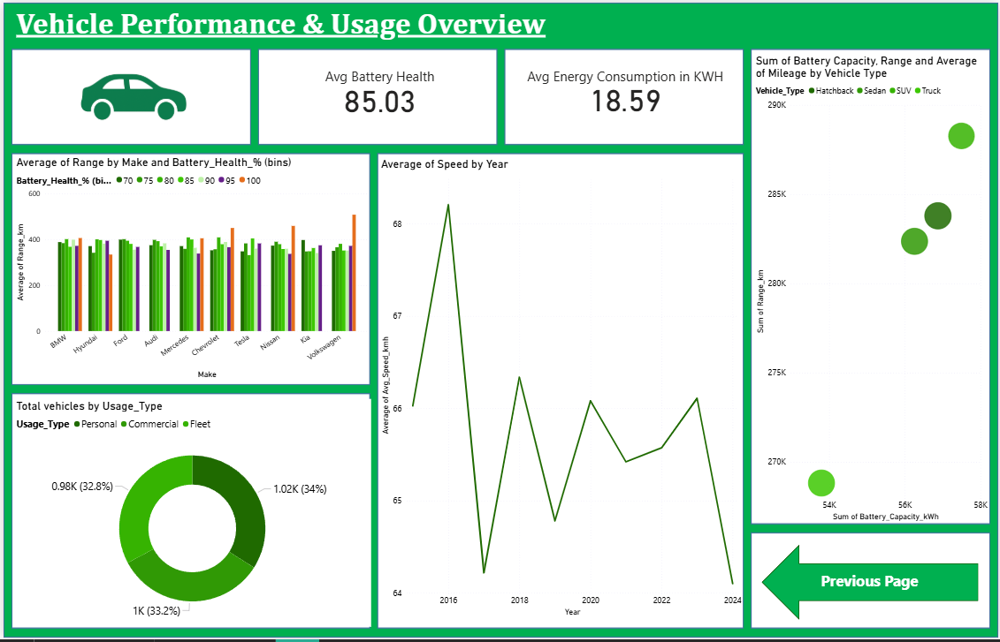

# Electric Vehicle Data Analysis using Power BI

## Project Overview
This project analyzes Electric Vehicle (EV) adoption trends using Power BI dashboards.  
The goal was to identify growth patterns, regional distribution, and manufacturer trends in EV usage.

## Tools Used
- Power BI
- Excel
- Data Cleaning
- Data Visualization

## Key Features
- Interactive dashboard with filters
- Region-wise EV distribution analysis
- Manufacturer-wise EV comparison
- Growth trend visualization
- KPI-based performance indicators

## Dataset
- Electric Vehicle dataset used for analysis
- Data cleaned and transformed using Excel

## Dashboard Preview

### EV Overview Dashboard

### EV Regional Analysis Dashboard

## Key Insights
- Identified regions with highest EV adoption
- Analyzed manufacturer performance trends
- Observed growth patterns across regions
- Compared EV distribution across different manufacturers

## Project Files Included
- EV_Dashboard_project.pbix → Power BI Dashboard
- electric_vehicle_analytics.xlsx → Dataset
- Dashboard Screenshots → Visual Preview

## Author
Mohammed Jasim  
Aspiring Data Analyst
